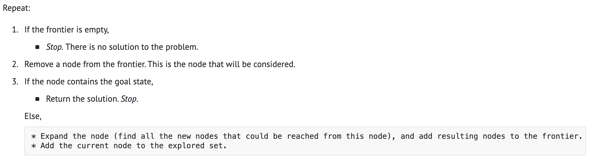

bfs？这和搜索有啥关系，感觉更为接近得是分治，不断划分子问题，然后因为要最少，还得贪心？完全没头绪。

## BFS 

> - 可以将每个整数看成图中的一个节点，如果两个整数之差为一个平方数，那么这两个整数所在的节点就有一条边。
>- 要求解最小的平方数数量，就是求解从节点 n 到节点 0 的最短路径。
>   - 那么图中的边长是下限为1上限为$\sqrt{n}$ 的完全平方数 
>   - 最短路径适合BFS，维护一个搜索队列。那怎么记录📝层数？队列里的数据结构还要附带层数信息似乎可行，但是否有更精简得方法？



### 个人实现

```cpp
vector<int> getSquaresEdge(int n) {
  vector<int> ans;
  int i = 1;
  while (i * i <= n) {
    ans.push_back(i * i);
    i++;
  }
  return ans;
}

int numSquares(int n) { 
    vector<int> squares = getSquaresEdge(n);
    queue<pair<int, int>> q; 
    q.push(make_pair(0, 0)); 
    while(!q.empty()){
      pair<int,int> cur = q.front();
      q.pop();
      if(cur.first == n) return cur.second;
      for(int i = 0; i < squares.size(); i++){
          q.push(make_pair(cur.first + squares[i], cur.second + 1));
      }
    }
    return -1;
}
```

> 超时同时内存不够

## 动态规划

//todo


[279. 完全平方数 - 力扣（LeetCode）](https://leetcode.cn/problems/perfect-squares/description/)

[Leetcode 题解 - 搜索 | CS-Notes 面试笔记 (cyc2018.xyz)](https://www.cyc2018.xyz/算法/Leetcode 题解/Leetcode 题解 - 搜索.html#_1-计算在网格中从原点到特定点的最短路径长度)

