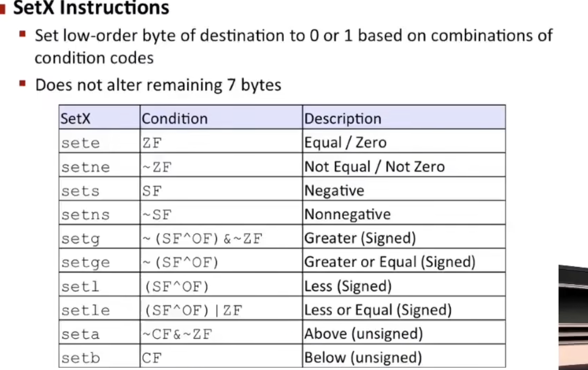
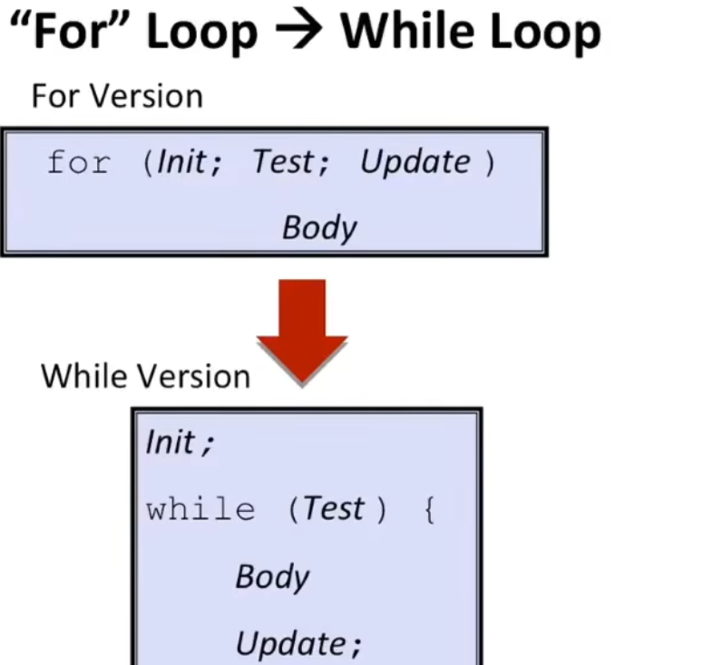
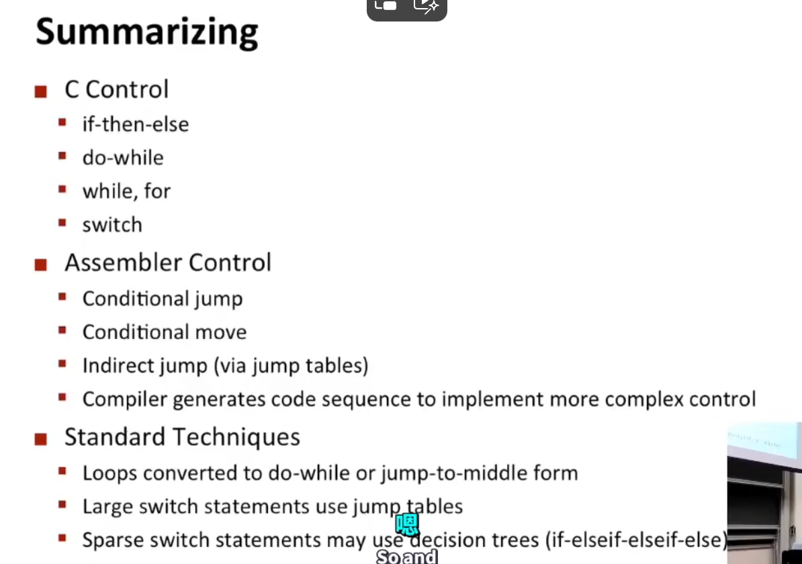

# Ⅰ

**c转汇编**

`linux> gcc -Og -S mstore.c`

-s 意味着stop

**目标文件反汇编**

`linux> objdump -d mstore.o`


红色部分代表指令对应到内存地址

**可执行程序反汇编**

`linux> objdump -d prog`

可以使用gdb对可执行程序进行反汇编 


%r 的寄存器 64位，%e寄存器 32位, 红色的寄存器特定用来存栈指针


> 在计算机体系结构中，寄存器、内存和立即数是三种基本的数据存储和操作方式，它们各有特点和用途。
>
> ### 1. 寄存器（Registers） 理解为桌上的书
>
> 寄存器是处理器内部的非常小但速度极快的存储位置。它们直接集成在 CPU 中，可以提供极快的读写速度。寄存器用于存储指令、数据和地址信息，是执行所有类型的运算操作时的主要工作区域。
>
> - **速度**：非常快，通常只需要一个 CPU 周期。
> - **容量**：非常有限，现代处理器可能只有几十个寄存器。
> - **用途**：存储当前正在处理的数据和指令的中间结果。
>
> ### 2. 内存（Memory） 理解为图书馆里的书
>
> 内存或主存（通常指随机访问存储器，RAM）是一种容量较大但速度较慢的存储设备，位于 CPU 和硬盘之间。它用于存储正在运行的程序和当前使用的数据，以便快速访问。
>
> - **速度**：比硬盘快，但比寄存器慢。内存访问可能需要几十到几百个 CPU 周期。
> - **容量**：比寄存器大得多，现代计算机通常配置几GB到几十GB的 RAM。
> - **用途**：存储程序代码和数据，供 CPU 直接访问。
>
> ### 3. 立即数（Immediate Values）
>
> 立即数是指令中直接嵌入的数值，不需要从寄存器或内存中读取。这种方式可以提高处理速度，因为数据直接在指令中指定，无需额外的存储访问。
>
> - **速度**：非常快，因为数据直接包含在指令中。
> - **容量**：通常大小有限，受指令集设计的限制（如x86架构中立即数可能是8位、16位、32位或64位）。
> - **用途**：用于那些需要快速获取小量数据的操作，如简单算术或逻辑运算。
>
> ### 总结
>
> - **寄存器**：用于高速缓存极少量的关键数据和中间结果。
> - **内存**：用于存储大量数据，包括程序和它们处理的数据。
> - **立即数**：用于指令中直接定义的小数据值，快速执行简单操作。


> `LEAQ`（Load Effective Address, Quad）是 x86-64 指令集中的一个指令，用于计算有效地址并将其加载到目标寄存器中。在 32 位系统中，相对应的指令是 `LEA`（Load Effective Address）。虽然这个指令在形式上类似于移动指令，但它实际上不访问内存中的数据，而是计算地址本身。
>
> ### 功能
>
> `LEAQ` 指令通常用于以下目的：
>
> - **地址计算**：直接计算出一个地址而不进行内存访问。这可以用于指针运算、数组索引计算等。
> - **算术运算**：间接用于进行某些简单的算术运算，如乘法和加法。因为它可以在单个指令中结合多个运算（如加法和乘法），从而有时可以替代更多的算术指令。
>
> ### 语法
>
> 在 AT&T 语法中，`LEAQ` 的基本格式是：
>
> ```
> bash
> 复制代码
> leaq source, destination
> ```
>
> 其中 `source` 是一个内存寻址表达式，`destination` 是一个寄存器。注意，在 Intel 语法中，顺序相反：
>
> ```
> bash
> 复制代码
> leaq destination, source
> ```
>
> ### 例子
>
> 假设 `RAX` 寄存器中存储了某个基址，而你想要计算这个基址加上某个偏移量后的地址，并将结果存储到 `RBX` 寄存器中，可以使用类似以下的指令：
>
> ```
> assembly
> 复制代码
> leaq (%rax, %rdx, 4), %rbx
> ```
>
> 这条指令计算的是 `RAX + RDX*4` 的地址，并将结果存储在 `RBX` 中。这里 `%rdx` 可以是数组的索引，4 是索引的大小倍数（假设数组元素是 4 字节大小，如 int 类型）。
>
> `p = &x[i]`
>
> ### 使用场景
>
> `LEAQ` 指令因其灵活性和效率，在优化代码时非常有用。它可以：
>
> - 快速地进行地址计算。
> - 在某些情况下替代简单的算术指令。
> - 用于复杂表达式的计算，减少多个运算步骤。


# Ⅱ



> 我们通过一些具体的编程例子来更好地理解这些 `SetX` 指令的工作方式。这些指令通常在条件语句的实现中非常有用，比如在汇编语言或底层系统编程中。
>
> ### 例1：sete / setz 指令
>
> **指令功能**: 设置目标寄存器的最低字节为1，如果上一个算术或逻辑操作的结果为0（即ZF标志被设置）。
>
> **场景**: 假设我们需要检查两个数是否相等，然后基于这个结果进行不同的操作。
>
> ```
> assembly
> 复制代码
> cmp eax, ebx       ; 比较EAX和EBX寄存器的值
> sete cl            ; 如果EAX和EBX相等（结果为0），CL寄存器被设置为1
> ```
>
> 如果 `eax` 和 `ebx` 的值相等，`cmp` 指令会将ZF标志设置为1，此时 `sete cl` 将CL寄存器的最低字节设置为1。如果不相等，CL寄存器的最低字节被设置为0。
>
> ### 例2：setg / setnle 指令
>
> **指令功能**: 如果最后一次有符号比较的结果大于0（即结果既非零也没有符号冲突），设置目标寄存器的最低字节为1。
>
> **场景**: 用于比较两个有符号整数，并检查一个数是否严格大于另一个数。
>
> ```
> assembly
> 复制代码
> cmp esi, edi       ; 比较ESI和EDI寄存器的值
> setg dl            ; 如果ESI大于EDI（有符号比较），DL寄存器被设置为1
> ```
>
> 如果 `esi` 大于 `edi` ，`cmp` 指令会确保ZF为0（结果不为0）且SF等于OF（没有符号错误），此时 `setg dl` 将DL寄存器的最低字节设置为1。如果 `esi` 小于或等于 `edi`，DL寄存器的最低字节被设置为0。
>
> 这些例子展示了如何使用 `SetX` 指令来根据比较结果设置特定的寄存器，从而允许程序根据这些条件进行分支或执行特定的代码路径。这种方式在需要精细控制处理器行为的系统级编程中非常有用。


因为指令流水线与分支预测，汇编语言默认执行所有分支 最后再决定取那个

循环中 while ，do while 都可以改成goto形式 goto在汇编中有对应，for则先转化为while





# III procedures 

